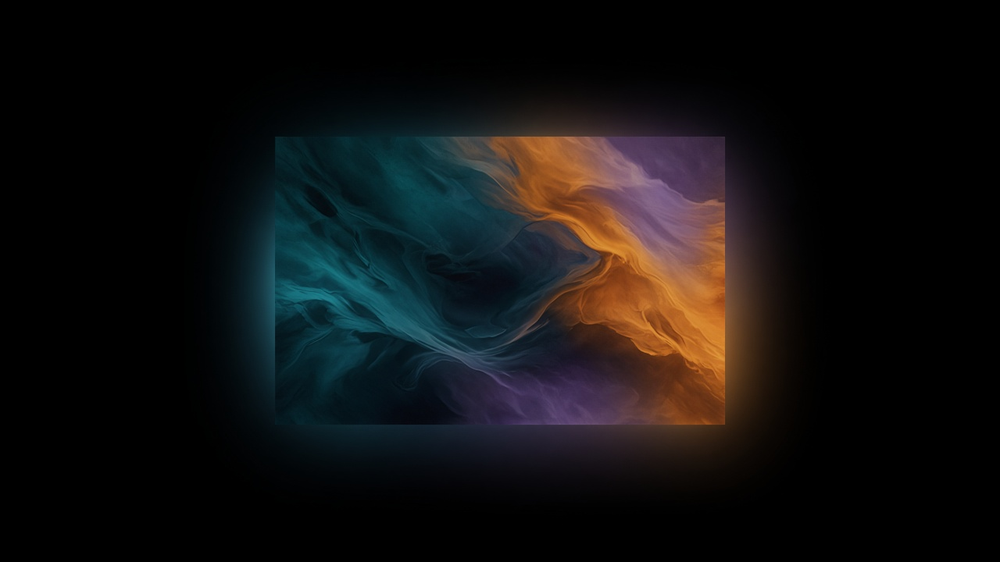

# Ambient Light for YouTube, Safari

Soft light around the YouTube player, in the color of the frame you are watching. Personal Safari build of [youtube-ambilight](https://github.com/WesselKroos/youtube-ambilight) by Wessel Kroos.

## What it does

The glow continues the edge of the video out onto the page. It is not a second copy of the picture behind the player. An **AL** button in the player opens the same kind of controls as the original: blur, spread, color filters, which sides to light, and view modes.

This build does not include black-bar detection, page shadows, or the original stats panel.

## Install in Safari

Tested as a temporary extension. After you quit Safari you add the folder again.

1. Download this repository and keep the folder that contains `manifest.json`.
2. Safari → Settings → Advanced → turn on **Show features for web developers**.
3. Safari → Settings → Developer → turn on **Allow Unsigned Extensions**.
4. Develop → **Add Temporary Extension…** and choose that folder.
5. Open any video on youtube.com.

If Develop has no **Add Temporary Extension**, this Safari is older. Pack the folder with `xcrun safari-web-extension-packager` and run it from Xcode with a free Apple ID. A free signature lasts about a week.

## Settings

The **AL** button and the toolbar icon open the same panel. **Buttons & boxes background opacity** fades the description card under the player. The original default is 10. Zero makes that card clear. Below zero fills it darker.

## Credit

Based on [Wessel Kroos / youtube-ambilight](https://github.com/WesselKroos/youtube-ambilight). The license in this repository is the original MIT license.
